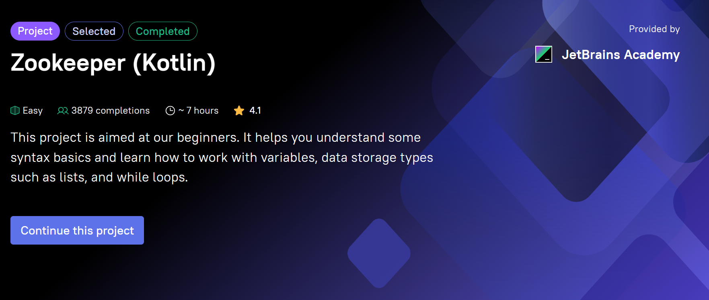

# Zookeeper

[Zookeeper](https://hyperskill.org/projects/196) is one of the projects of [Kotlin developer](https://hyperskill.org/tracks/3) track 
at Hyperskill, and contains 4 stages.

This  project that simulates some of the everyday tasks of a zookeeper 
and helps them take care of the animals efficiently, dealing with variables, reading input, printing output and using loops in Kotlin.

